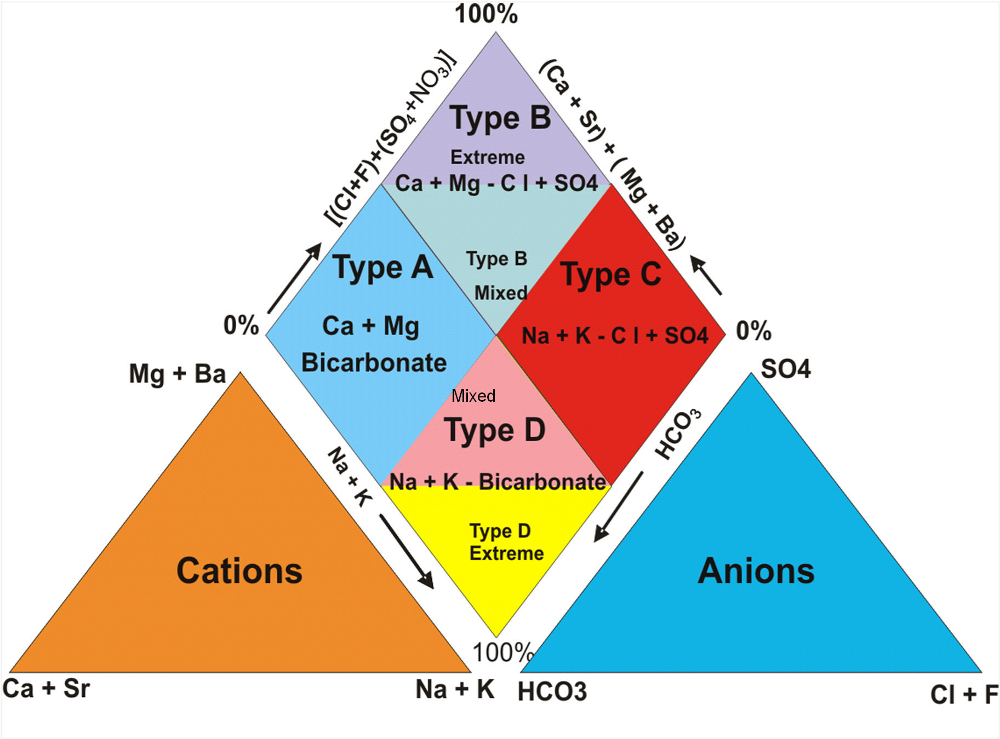
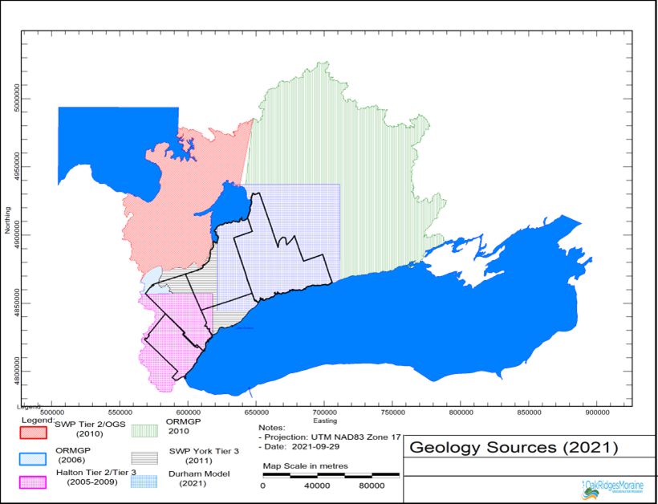

The ORMGP Geocortex Mapping hub has been divided into various **Theme Maps** to allow users to quickly hone in on the information they might be seeking. For example, the **Documents Theme Map** provides access to the program's library of reports, The **Boreholes Theme Map** focuses on providing access to borehole specific information, and the **Geology Theme Map** provides access to all of the ORMGP geologically related mapping. The Theme Maps group specific related data sets or interpreted products, such as:

* TOC
{:toc}

**The Layer Catalogue/User Customization**

Within any theme, users can incorporate items from any other theme map (e.g. bedrock boreholes can be shown on the Geology Theme map alongside the Bedrock Topography map); this is accomplished through the Geocortex "Layer Catalogue". 

# Basemap Layers present on all Themes
There are some data sets or products that appear on more then one theme map. All themes consist of our regional basemap:

- **ORMGP Boundary** – Incorporates entirety of three Source Water Protection Regions (CTC, Southern Georgian Bay – Lake Simcoe, and Trent Coalition) as well as a Halton focused part of the Hamilton/Halton Source Water Protection Region.
- **Upper and Single Tier Boundaries**[https://geohub.lio.gov.on.ca/](https://geohub.lio.gov.on.ca/)
- **Lower Tier Boundaries** -Provincial dataset obtained at [https://geohub.lio.gov.on.ca/](https://geohub.lio.gov.on.ca/)
- **Conservation Authority Boundary** -Provincial dataset obtained at [https://geohub.lio.gov.on.ca/](https://geohub.lio.gov.on.ca/)
- **Watershed Boundary** - Provincial dataset obtained at [https://geohub.lio.gov.on.ca/](https://geohub.lio.gov.on.ca/)
- **Subswatershed Boundary** – provided by Conservation Authority partners
- **ORM Plan Boundary** - Provincial dataset obtained at [https://geohub.lio.gov.on.ca/](https://geohub.lio.gov.on.ca/)
- **Niagara Escarpment Plan Boundary** - Provincial dataset obtained at [https://geohub.lio.gov.on.ca/](https://geohub.lio.gov.on.ca/)
- **Greenbelt Plan Boundary** - Provincial dataset obtained at [https://geohub.lio.gov.on.ca/](https://geohub.lio.gov.on.ca/)
- **Transportation** - Provincial dataset obtained at [https://geohub.lio.gov.on.ca/](https://geohub.lio.gov.on.ca/)
- **Lots and Concessions** - Provincial dataset obtained at [https://geohub.lio.gov.on.ca/](https://geohub.lio.gov.on.ca/)
- **Assessment Parcels** - Provincial dataset obtained at [https://geohub.lio.gov.on.ca/](https://geohub.lio.gov.on.ca/)

**General Note:**

In the following pages, where appropriate/known the date listed in brackets after the legend item indicates when the item was last worked on or updated. Where no date is reported assume that the legend item is day to day continually being worked upon and improved. Unless otherwise stated the legend items have been compiled or prepared by ORMGP staff. Basemap layers or data sources from external agencies (e.g. Province, Federal, partners) are linked to the website where ORMGP obtained the information.

# Location Map

This map is designed to show the various Location Types that are found in the ORMGP database.

- **All Boreholes** – Compiled by ORMGP from a variety of sources including: MECP WWIS Records; City of Toronto Geotechnical Database, Ontario Geological Survey Urban Geotechnical Automated Information System; MNR Oil and Gas Wells, Other Consultant/Government BHs from various sources. **Updated** : At least once per year from MECP WWIS ([https://data.ontario.ca/dataset/well-records](https://data.ontario.ca/dataset/well-records)); regularly from BHs input by ORMGP staff; note that BHs found to be in error (e.g. location, geology, imperial vs metric units, etc.) are corrected/fixed on a regular basis as errors are found. Therefore wells found in other databases (e.g. MECP WWIS) might not match what is found on the ORMGP portal.
- **Groundwater Knowledge/Insight** – Compiled from stories passed down by experienced government and consultant staff. **Updated:** Periodically as new stories are uncovered.
- **Flowing Water Information Sites (FWIS)** – Contains links to a database currently (2022) held at the University of Waterloo. The database incorporates information (geomorphology, fish, benthic, etc.) acquired using the Ontario Stream Assessment Protocol (OSAP), on stream sites throughout southern Ontario. The database was originally referred to as the HabProgs database and was built as a collaborative effort of many government and research agencies. The database was originally set up out of MNR's offices at Glenora. **Updated:** Contact FEWS custodians.
- **Oil and Gas Wells** – data obtained from the Oil, Gas and Salt library of the MNR. **Updated:** Periodically, approximately every five years.
- **Outcrop** – data obtained from the Geological Survey of Canada in early 2000s and includes GSC and OGS outcrops that were part of the geological work around the Oak Ridges Moraine area undertaken through the 1990s. Updated: No.

- **Surface Water - Spot Flow** – shows those stations where partner agency staff, ORMGP staff, or a consultant has visited a surface water location for the purposes of measuring the flow. Flow data is held in ORMGP database. **Updated:** Sporadically as data is acquired from various partner agencies.

- **Surface Water - Gauge Stations** – Stations mostly comprised of Hydat Stations plus a few stations operated by Conservation Authority Partners. **Updated:** Stations are periodically added as they are discovered or provided by partner agencies. Streamflow data updated regularly from Environment Canada website ([https://wateroffice.ec.gc.ca/](https://wateroffice.ec.gc.ca/)).
  - Active – stations having streamflow data in the past three months
  - Aggregated – stations that moved a very short distance in the past (i.e. measuring the same reach of stream) – allows for longer period of record to be analysed.
  - Discontinued – stations with no streamflow data in past three months.
- **Climate Stations** – Stations mostly comprised of Environment Canada climate stations plus a few stations operated by Conservation Authority or Municipal Partners. **Updated:** Stations are periodically added as they are discovered or provided by partner agencies. Climate data (temperature and precipitation) updated regularly from Environment Canada website ([https://weather.gc.ca/](https://weather.gc.ca/)).
  - **Active** – stations having data within the past three months
  - **Discontinued** – stations with no climate data in past three months.
- **Permits To Take Water** – Data downloaded from MECP website. **Updated** : Periodically (approximately every three years) from MECP website ([https://data.ontario.ca/dataset/permit-to-take-water](https://data.ontario.ca/dataset/permit-to-take-water)).
  - **Active** – stations where Permit expiry date is in the future.
  - **Discontinued** – stations where Permit expiry date has passed.

# Boreholes Map

This map is designed to help users find wells that meet certain requirements.

- **All Boreholes** - Compiled by ORMGP from a variety of sources including: MECP WWIS Records; City of Toronto Geotechnical Database, Ontario Geological Survey Urban Geotechnical Automated Information System; MNR Oil and Gas Wells, Other Consultant/Government BHs from various sources. **Updated** : At least once per year from MECP WWIS ([https://data.ontario.ca/dataset/well-records](https://data.ontario.ca/dataset/well-records)); regularly from BHs input by ORMGP staff; note that BHs found to be in error (e.g. location, geology, imperial vs metric units, etc.) are corrected/fixed on a regular basis as errors are found. Therefore wells found in other databases (e.g. MECP WWIS) might not match what is found on the ORMGP portal.
- **Boreholes with Supplementary Log** – filtered to show wells where ORMGP staff have linked a consultant or other BH log PDF to a specific well/BH. **Updated:** regularly as reports are processed and PDF copies of BH logs are linked.
- **Boreholes with Geophysical Log** – filtered to show wells where ORMGP staff have linked a consultant or other geophysical log to a specific well/BH. **Updated:** regularly as reports are processed and PDF copies of geophysical logs are linked.
- **Bedrock Wells** – Filtered to show all wells where the predominant material (Material 1) in at least one geological layer intersected by the well is rock (e.g. shale, limestone, dolostone, bedrock, etc.).
- **Overburden Wells** – Filtered to show all wells where the predominant material (Material 1) in all geological layers intersected by the well is never reported to be rock (e.g. shale, limestone, dolostone, bedrock, etc.).
- **York/Durham/Peel/Halton Region Wells** – filtered to show all wells that have been linked to the each Regional Municipality. This has been done in partnership with the municipality and includes old exploration wells, current and former monitoring wells, and current and former pumping wells. Wells tied to Local Municipalities (e.g. prior to the formation of the Regional Municipalities) in the early 1970s are also flagged here. (Hint – to replicate with All BHs – use the Filter Tool under Specialty Tools and Analysis and set up Filter so that Name - Alternate Name Contains "York or Durham or Peel or Halton")
- **Municipal Wells** – filtered to show wells where the MECP or program/partner agency staff have identified a well as having been drilled for exploration/monitoring/pumping. (Hint - to replicate with All BHs – use the Filter Tool under Specialty Tools and Analysis and set up Filter so that BH Purpose Secondary Contains "Municipal")
- **PGMN Wells** – filtered to show wells that are currently (or were at one time) part of the Provincial Groundwater Monitoring Network. (Hint – to replicate with All BHs – use the Filter Tool under Specialty Tools and Analysis and set up Filter so that Name Contains "PGMN")
- **OWRC Monitoring Wells** – filtered to show wells that were part of the previous Provincial Monitoring program back in the 1970s and 1980s. (Hint – to replicate with All BHs – use the Filter Tool under Specialty Tools and Analysis and set up Filter so that Name Contains "MOE OW")
- **Wells With Active Barometric Loggers** – filtered to show wells with barometric loggers that have data within the past 6 months.
- **Flowing Wells** – Filtered to show those wells where at least one screen was observed to be flowing at the ground surface, generally at the time of drilling.
- **Higher Capacity Wells** – filtered to show wells where the driller has recommended that the well can provide greater than 50 IGPM (Hint – to replicate with All BHs – use the Filter Tool under Specialty Tools and Analysis and set up Filter so that BH – Rec Pumping Rate \>50).
- **Geotechnical Wells** – filtered so that only geotechnical wells are shown. (Hint – to replicate with All BHs – use the Filter Tool under Specialty Tools and Analysis and set up Filter so that Purpose Secondary Contains "Geotech Testhole")
- **Oil and Gas Wells** – filtered to only show the Oil and Gas wells from the MNR Oil, Gas and Salt database.
- **PQ Cored Wells** – filtered to only show wells that have been drilled using a PQ coring technique, these wells having an improved geological interpretation (especially in glacial sediments) over holes drilled using other drilling techniques that do not preserve that core (e.g. mud rotary). (Hint – to replicate with All BHs – use the Filter Tool under Specialty Tools and Analysis and set up Filter so that BH – Drill Method Contains "PQ").
- **All Non-MECP Wells** – filtered to show the vast number of wells that, within the ORMGP, have been added to the MECP WWIS wells from various sources.
- **All MECP Wells** – filtered to show all the wells that have come from the MECP Database.
- **MECP Decommissioned Wells** – filtered to show those records where an MECP well record form has been noted to indicate the decommissioning of an earlier drilled well. These are not consistently flagged by MECP staff. When a well record is noted to reflect a decommissioning, ORMGP staff will change the record in the database to reflect this status.
- **MECP Record of Well Alteration** – Indicates well locations where MECP indicates that a previously drilled well has been altered (e.g. deepened, new liner, etc.) generally to improve or maintain well performance.
- **MECP Wells – Need Coordinates Checked** – filtered to show locations where the Location Coordinate Code (as assigned by the MECP) is \>5, thus indicating that there is 300 m or greater in the uncertainty of the assigned well coordinates. The geological interpretations from these wells that are poorly located are not used to construct geological layers. This set of wells is largely shown so that ORMGP staff can readily locate wells and use the WWIS record to more accurately locate the well.

# MECP WWIS Wells Map

This map simply shows only MECP wells. Within the various legend items the MECP wells have been filtered to reflect the jurisdictional geography of the various agencies partnered in the ORMGP.

# Groundwater Quality Map

This map is designed to show well locations where water quality information has been acquired in the past.

- **All wells with chemistry data** – shows every well in the ORMGP database where water quality sample(s) have been taken. This would include wells where only a limited number of parameters have been analysed and wells where a full suite of parameters have been analysed. To see the water quality data users must take note of the well Name and then use the "Monitoring Data" tool to find the well and extract the data. This methodology will be updated to make the acquisition of the data much more straightforward.
- **Wells (Only 1 Sample)** – filtered to show those wells that have only been sampled on one occasion.
- **Wells (\> 1 Sample)** – filtered to show those wells that have been sampled on more than one occasion. Most often these wells are part of a municipal monitoring program.
- **Piper Plot Water Types**
  - **All wells with Geochemistry Data** – shows all wells with sufficient parameters (i.e. major cation and anion analyses) to prepare a Piper Plot;
  - **Type A - Ca/Mg Bicarbonate** – shows wells where the Piper plot reflects a dominance of these ions;
  - **Type B – Calcium Chloride** – shows wells where the Piper plot reflects a dominance of these ions;
  - **Type C – Sodium Chloride** - shows wells where the Piper plot reflects a dominance of these ions;
  - **Type D – Sodium Bicarbonate** - shows wells where the Piper plot reflects a dominance of these ions;

- **Wells Filtered by Interpreted Formation** – the screens from all wells are compared against the geological layers. Where screened interval corresponds in its entirety to a single geological unit then that unit is assigned. In cases where the screen straddles one or more formations then there are a series of rules to assign the screen to the most likely geological unit.

# Groundwater Levels Map

The map is designed to present all wells where longer term water level monitoring has been undertaken in the past or is currently taking place.

- **All Wells with \>35 Water Levels** – it was found that many water well records can contain up to 30 water level measurements taken over the duration of a short term test undertaken upon completion of well drilling. Therefore wells having more than 35 water levels are generally longer term monitoring locations.
- **Active Monitoring Wells** – filtered to only show wells having water level data within the past 12 months
- **Municipal Pumping Wells** – filtered to show those wells that have been identified as being used for municipal drinking water supplies. Wells are shown as either being currently active or decommissioned.
- **Monitoring Nests (More than One Screen)** – filtered to show all Locations that have more than one screen associated with them. (Note that sometimes the different screens (Intervals) can be tied to one Location in the database and other times they can be tied to different locations situated side by side.
- **Wells Filtered by Interpreted Formation** – the screens from all wells are compared against the geological layers. Where screened interval corresponds in its entirety to a single geological unit then that unit is assigned. In cases where the screen straddles one or more formations then there are a series of rules to assign the screen to the most likely geological unit.

# Documents Map

This map is designed to allow users to access that many documents that are in the ORMGP library.

- **All Documents** – displays all of the documents that have x/y coordinates that are held in the ORMGP library.
- **Documents by Scale** – a decision was made to capture the x/y coordinate (points) of each report rather than capture the area that each report covers (area). As a result some of the more regionally focused reports could be difficult to locate on a map, especially if users are zoomed in on a site. Note that, where appropriate, reports that are regional or provincial in scope, have been placed at the location of the office that prepared the report (e.g. Queen's Park, Parliament Hill, MOE office at 401 and Islington, Regional Offices on Highway 25 (Halton), Queen St. (Peel),Yonge St. (York), Rossland Rd. (Durham),City Hall, (Toronto), etc.)

# Stream Profiles Map

This map is designed to provide cross sections directly tied to the stream segment network so that users can see, for example, places where aquifers are interpreted to intersect the stream bottom (active GW discharge). Note that ORMGP is working to enable this feature in the dynamic cross section tool for all streams in the ORMGP study area.

- **Stream Profile** (2015) – displays all of the available stream profiles/cross-sections.

# Numerical Models Map

The map is designed to show the boundaries of all of the numerical models held in the ORMGP [Numerical Model Custodianship Program](https://owrc.github.io/snapshots/md/numerical-model-custodianship-program.html). Through partner agencies, the ORMGP has acquired over 80 numerical models from various consultants. The model have been run to completion to ensure that all relevant files are present, and the Models are available through the program with the signing of a model sharing agreement.

- **Numerical Models by Model Code** – all of the models are classified by the code that was used to create the numerical model. The map allows users to see the area and/or boundaries of each model, and by clicking on any model area, obtain the model report.

# Geology Map

This map is designed to provide access to all of the geologically related mapping that is available in the ORMGP study area.

- **Geological Features**
  - **Canadian Shield** (2020) – initial demarcation of the Shield boundary was initially created for a Uof T led project and brought over to ORMGP where, within the study area, ORMGP staff have adjusted it based on more recent OGS Surficial Geology mapping and well record data.
  - **Niagara Escarpment** (2010) – created to delineate/estimate the crest of the Niagara Escarpment, by ORMGP staff using both the OGS Surficial Geology mapping and ground surface topography (Digital Elevation Model).
  - **Iroquois Shoreline** (2017) – created to delineate/estimate the shoreline of former glacial Lake Iroquois, by ORMGP and TRCA staff using a combination of OGS Surficial Geology and Physiography mapping as well as the ground surface topography (Digital Elevation Model).
  - **Tunnel Channel Thalweg** (2014) – created to demarcate the trend of tunnel channel erosional features, by ORMGP staff using a combination of GSC documentation and ground surface topography (Digital Elevation Model).
  - **Bedrock Thalweg** (2021) – created to delineate/estimate the trend of bedrock valleys, by ORMGP staff using borehole/well data.
  - **Closed Depressions** (2005) – created for ORMGP by MNR staff (see Bates, 2005; ORMGP Document Folder 1072) to identify areas that might have focused groundwater recharge.
  - **Hummock Topography** (2005) - created for ORMGP by MNR staff (see Bates, 2005; ORMGP Document Folder 1072) to identify areas of significant variable topography that might be indicative of focused groundwater recharge.
  - **Karst Known/Karst Inferred** – shows areas of known and inferred karst across the study area. See Brunton et al 2005, Brunton and Dodge, 2008 (ORMGP Folder 5301)) (from OGS - Map Downloaded from GeologyOntario ([http://www.geologyontario.mndm.gov.on.ca/](http://www.geologyontario.mndm.gov.on.ca/))
- **Physiographic Regions** – Shows the various physiographic regions across the study area, building upon original early work by Chapman and Putnam (from OGS - Map Downloaded from GeologyOntario ([http://www.geologyontario.mndm.gov.on.ca/](http://www.geologyontario.mndm.gov.on.ca/))
  - **Physiography** – layer shows the physiography (e.g. till plains, sand plains, moraines, etc.) across the ORMGP without grouping terrains and assigning them names (from OGS - Map Downloaded from GeologyOntario ([http://www.geologyontario.mndm.gov.on.ca/](http://www.geologyontario.mndm.gov.on.ca/))
- **Bedrock Geology** – shows the bedrock units beneath the Quaternary sediment cover (from OGS - Map Downloaded from GeologyOntario ([http://www.geologyontario.mndm.gov.on.ca/](http://www.geologyontario.mndm.gov.on.ca/))
- **Bedrock Topography**
  - **Bedrock Topography (ORMGP)**(2022) – shows the bedrock surface as interpreted over the years by ORMGP staff along with various consultants. The interpretation of the bedrock surface is one of a fluvial type system along the Laurentian Channel with tributaries coming in from both the east and west.
  - **Bedrock Topography (MNDM)** – shows the bedrock surface as interpreted by the Ontario Geological Survey. The OGS only uses BH/well data to create their surface, so the connectivity along the bedrock lows is not as pronounced as in the ORMGP map (from OGS - Map Downloaded from GeologyOntario ([http://www.geologyontario.mndm.gov.on.ca/](http://www.geologyontario.mndm.gov.on.ca/)).
- **Quaternary Sediment Thickness (Depth to Bedrock (m)**
  - **Quaternary Sediment Thickness (ORMGP)** – reflects the ORMGP thickness of the glacial sediments sitting on top of bedrock. Obtained by subtracting the Bedrock Topography (ORMGP) from the Ground Surface (Digital Elevation Model).
  - **Quaternary Sediment Thickness (OGS)** – reflects the OGS thickness of the glacial sediments sitting on top of bedrock. (from OGS - Map Downloaded from GeologyOntario ([http://www.geologyontario.mndm.gov.on.ca/](http://www.geologyontario.mndm.gov.on.ca/))
- **SOLRIS v2** – shows the provincial Southern Ontario Land Information System (SOLRIS) layer across the study area. Downloaded from ([https://geohub.lio.gov.on.ca/](https://geohub.lio.gov.on.ca/))
- **Surficial Geology**
  - **Surficial Geology (OGS MNDM)** – reflects the surficial geology across the study area as compiled by the OGS. (from OGS - Map Downloaded from GeologyOntario ([http://www.geologyontario.mndm.gov.on.ca/](http://www.geologyontario.mndm.gov.on.ca/))
  - **Surficial Geology (GSC)** (2006) – reflects the surficial geology across the study area as compiled by the GSC. (from GSC – map downloaded from Geoscan ([https://geoscan.nrcan.gc.ca/starweb/geoscan/servlet.starweb?path=geoscan/fulle.web&search1=R=222772](https://geoscan.nrcan.gc.ca/starweb/geoscan/servlet.starweb?path=geoscan/fulle.web&search1=R=222772))
- **Geological Units** (2022) – provides interpreted maps of each of the major glacial sediment layers across the study area. Layers were constructed by making geological picks on wells in cross-section views along the E-W and N-S roads across the study area. For each layer both the "Top of" and the "Isopach" are provided along with contours. Work has been undertaken by ORMGP staff as well as by various consulting firms that have led various SWP projects across the study area. Figure below provides summary of layer origins.

- **DEM**
  - **DEM 25m (ORMGP)** – Layer prepared by ORMGP by taking the Provincial 10 m DEM and resampling to a coarser 25m grid spacing. This was done to reduce the size of the file to make it more manageable for various processes. Bathymetry in Lake Ontario, Georgian Bay and Lake Simcoe has similarly been coarsened. – Mike – is this correct?
  - **DEM 10m - Bathymetry (MNRF)** – Shows bathymetry of:
    - **Georgian Bay** – surface available through National Geophysical Data Centre at ([https://www.ngdc.noaa.gov/mgg/greatlakes/huron.html](https://www.ngdc.noaa.gov/mgg/greatlakes/huron.html)).
    - **Lake Simcoe** - Mike – I don't see this anywhere on geohub or elsewhere - do you have a source for it?
    - **Lake Ontario** – surface available through National Geophysical Data Centre at ([https://www.ngdc.noaa.gov/mgg/greatlakes/ontario.html](https://www.ngdc.noaa.gov/mgg/greatlakes/ontario.html)).

each lake can be turned on/off individually.

  - **DEM 10m – Ground Surface (MNRF)**
    - DEM 10m – Ground Surface (Dynamically Adjusted (MNRF) – Mike?
    - DEM 10m – Ground Surface (MNRF) – Mike?

# Water Table Map

This map is designed to provide interpolations of the water levels or hydraulic head across the study area, at various depths in the subsurface.

- **Source Data**
  - **Shallow Wells (\<20 m Deep)** – filtered to show wells where the bottom of the screen is less than 20 m below ground surface.
  - **Intermediate Wells** – filtered to show wells where the bottom of the screen is between 20 and 40 m below ground surface.
  - **Deep Wells** – filtered to show wells where the bottom of the well screen is greater than 40 m below ground surface.
  - **Water Bodies** – shows the three main water bodies whose elevations are incorporated into the Water Table surface (Lake Ontario – 75 mASL; Lake Simcoe – 219 mASL; Georgian Bay – 220 mASL)
  - **Streams (Strahler Class \>3)** – displays the streams that have been incorporated into the rendering of the Water Table 1 surface.
- **Water Table 0 (WT0)** – displays the interpreted Water Table surface, constructed by using water levels from shallow wells only and corrected to Ground Surface (see Water Table MetaData).
- **Depth To Water Table 0** – shows the interpreted depth WT0; derived by subtracting WT0 from Ground Surface (see Water Table MetaData).
- **Potential Discharge Areas** – shows those areas where WT) was found to be above ground surface prior to being 'corrected' to Ground Surface minus 0.5m (see Water Table MetaData). These areas might be indicative of where active groundwater discharge might be occurring (e.g. in river valleys and other lower lying areas).
- **Water Table 1 (WT1)** – displays the interpreted Water Table surface, constructed using water levels from shallow wells, larger streams and in some areas, intermediate depth wells (see Water Table Metadata).
- **Depth To Water Table 1 (WT1)** - shows the interpreted depth WT1; derived by subtracting WT1 from Ground Surface (see Water Table MetaData). Note that the display can be tailored to show specific areas where the Depth to WT1 is either \>10m; \> 5 m; \<1 m; \< 5m; \< 10m).
- **Water Table Difference (WT0-WT1)** – shows the difference between the two different Water Table surfaces.
- **Potentiometric Surface (PSO)** – shows the interpreted deep potentiometric surface using water levels from wells where the bottom of the screen is greater than 40 m below ground level, and corrected to Ground Surface.
- **Vertical Gradient (WT1 minus PS0)** – shows the vertical gradient between the upper water table surface and the deeper potentiometric surface. Note that the blue areas, indicative of upward gradients, are frequently associated with lower lying areas (e.g. river valleys).

# Water Budget Map

## (version 0.1)

This map is designed to provide preliminary projections of **Groundwater recharge, Runoff, Evapotranspiration and Precipitation** from a recharge–runoff model that was run in 2018. The model is a distributed model with a grid cell resolution of 250x250 m. The model has 330,000 active cells, covering 20,000 km² of the ORMGP study area. The model runs a 6-hr time step, (consistent with the 6-hr distributed precipitation input) and provides monthly water budget estimates. The model was run from 2002 to 2018.

Inputs to the model:

- Precipitation
  - The Regional Deterministic Precipitation Analysis based on the Canadian Precipitation Analysis (CaPA-RDPA) from Environment Canada; complete records since 2002; ~10km² grid, 6-hr totals.
- Temperature
  - Interpolated hourly temperatures from EC meteorological network, aggregated to 6-hr intervals
- Solar irradiation
  - Based on potential [solar irradiation theory](https://owrc.github.io/info/solarradiation/); model adjusts daylight hours at the cell-scale, according to slope and aspect; cloud-cover fraction dependent on precipitation occurrence.
- Potential Evapotranspiration
  - [Makkink (1957) method](https://owrc.github.io/info/evaporation/) (general form of Priestly-Taylor, dependent on temperature and potential irradiation); computed on a 6-hr basis
- Snowmelt
  - [cold content and snow water equivalent energy balance snowpack model](https://owrc.github.io/interpolants/modelling/waterbudget/snowmeltCCF.html); accounts for liquid storage and refreeze, for snowpack metamorphism, and rain on snow melt events.
- Explicit Soil Moisture Accounting scheme
  - SOLRIS mapping used for canopy cover, ground-vegetation cover, and impervious cover;
  - Chapman and Putnam surficial geology mapping used to distribute surficial storage and percolation rates.
- Routing
  - accomplished by accumulation runoff from every cell, and applying a triangular transfer function to translate effective precipitation into a hydrograph response.
- Groundwater
  - represented as a single linear reservoir.

# Land Use Map

This map is designed to present some of the significant land use designations that can affect land use change proposals across the lands in the ORMGP.

- **Areas of Natural and Scientific Interest (ANSI)** – displays these Natural Heritage Features, which in the 2020 Provincial Policy Statement (PPS), are to be "protected for the long term". Downloaded from ([https://geohub.lio.gov.on.ca/](https://geohub.lio.gov.on.ca/)).

- **Niagara Escarpment Plan** – shows the land use designations under the Niagara Escarpment Plan – certain land use restrictions apply to these lands as per the Niagara Escarpment Planning and Development Act. Downloaded from ([https://geohub.lio.gov.on.ca/](https://geohub.lio.gov.on.ca/))
- **Oak Ridges Moraine Plan** – shows the land use designations under the Oak Ridges Moraine Plan – certain land use restrictions apply to these lands as per the Oak Ridges Moraine Conservation Act. Downloaded from ([https://geohub.lio.gov.on.ca/](https://geohub.lio.gov.on.ca/))
- **Greenbelt Plan** – shows areas that are incorporated into the Greenbelt Plan – certain land use restrictions apply to these lands as per the Greenbelt Act. Downloaded from ([https://geohub.lio.gov.on.ca/](https://geohub.lio.gov.on.ca/))
- **Natural Heritage System** – Shows areas, including those that are also parts of the Niagara Escarpment, the Oak Ridges Moraine, and the Greenbelt Plans that are incorporated into Ontario's Natural Heritage System, which in the 2020 Provincial Policy Statement (PPS), are to be "protected for the long term".
- **Source Water Protection**
  - **Wellhead Protection Areas (WHPAs)** – displays the WHPAs as obtained from partner CAs and SWP authorities. These areas have certain land use restrictions placed on them under Ontario's Source Water Protection legislation.
  - **Intake Protection Zones (IPZs)**
  - **Wellhead Quantity**
    - **WHPA Q1**
    - **WHPA Q2**
  - **Highly Vulnerable Aquifers**

# Surface Water Map

The map is designed to provide access to all of the Surface Water related information held in the ORMGP.

- **All Surface Water Locations** (2022) - Compiled by ORMGP from a variety of sources including: Conservation Authority and other spot flow locations, Provincial Water Quality Monitoring Locations, SW Gauge Stations (operated through the Hydat program or by one of the partner agencies), Flowing Water Information Sites, other Consultant/Government SW Sites from various sources. **Updated** : Periodically – generally added to as new stations are discovered.
- **PWQMN Stations** – Shows those stations that are currently or previously part of the Provincial Water Quality Monitoring Network, generally stations along streams that are regularly sampled for a suite of water quality analyses.
- **Flowing Water Information Sites** - Contains links to a database currently (2022) held at the University of Waterloo. The database incorporates information (geomorphology, fish, benthic, etc.) acquired using the Ontario Stream Assessment Protocol (OSAP), on stream sites throughout southern Ontario. The database was originally referred to as the HabProgs database and was built as a collaborative effort of many government and research agencies. The database was originally set up out of MNR's offices at Glenora. **Updated:** Contact FEWS custodians.
- **Surface Water - Spot Flow** – shows those stations where partner agency staff, ORMGP staff, or a consultant has visited a surface water location for the purposes of measuring the flow. Flow data is held in ORMGP database. **Updated:** Sporadically as data is acquired from various partner agencies.
- **Surface Water - Gauge Stations** – Stations mostly comprised of Hydat Stations plus a few stations operated by Conservation Authority Partners. **Updated:** Stations are periodically added as they are discovered or provided by partner agencies. Streamflow data updated regularly from Environment Canada website ([https://wateroffice.ec.gc.ca/](https://wateroffice.ec.gc.ca/)).
  - Active – stations having streamflow data in the past three months
  - Aggregated – stations that moved a very short distance in the past (i.e. measuring the same reach of stream) – allows for longer period of record to be analysed.
  - Discontinued – stations with no streamflow data in past three months.

- **Climate Stations** – Stations mostly comprised of Environment Canada climate stations plus a few stations operated by Conservation Authority or Municipal Partners. **Updated:** Stations are periodically added as they are discovered or provided by partner agencies. Climate data (temperature and precipitation) updated regularly from Environment Canada website ([https://weather.gc.ca/](https://weather.gc.ca/)).
  - **Active** – stations having data within the past three months
  - **Discontinued** – stations with no climate data in past three months.

- [**10 km² Subwatersheds**](https://owrc.github.io/interpolants/interpolation/subwatershed.html)

- [**OHN Waterbody**](https://geohub.lio.gov.on.ca/) (2022) – shows the larger lakes and water bodies across the study area.

- [**Ordered Streams**](https://owrc.github.io/interpolants/interpolation/watercourses.html)
- **Modeled Groundwater Discharge to Streams (L/s/km)** (2021) – shows the GW/SW Interaction results (i.e. estimated or modelled groundwater discharge) from various numerical models held in the ORMGP model custodianship program.

# Hydraulic Properties Map

Map is designed to present estimated hydrogeological properties across the study area, currently Specific Capacity (SC), Hydraulic Conductivity (K) and Transmissivity (T). 

**General Note:**
When you turn on a layer you may notice that locations do not display.  Currently you need to zoom in to see location points. This is due to a software limitation in dealing with many locations and data which we hope to have solved in the future.

- **Hydraulic Conductivity (m/s)** – provides the results of various field tests (e.g. slug tests, pumping tests, etc.) undertaken at various wells across the study area. The results presented are obtained from tests conducted by ORMGP partners and also from reports in the ORMGP library.
- **Specific Capacity (L/min/m)** – for MECP WWIS (Ontario Ministry of Enviroment, Conservation and Parks Water Well Information System) records that contain the required information, presents the calculated specific capacity results from the short term testing that drillers undertake upon completion of the drilling of a new well.
- **Hydraulic Conductivity (m/s) (Bradbury and Rothschild, 1985)** – presents the estimated hydraulic conductivity calculated from Specific Capacity estimates using the methodology of Bradbury and Rothschild (1985) from the data acquired from short term testing that drillers undertake upon completion of the drilling of a new well. The methodology corrects for partial penetration, well loss and utilizes Formation (aquifer) thickness from the ORMGP 3D geologic interpretation.
- **Transmissivity (m²/s) (Bradbury and Rothschild, 1985)** – provides the estimated transmissivity calculated from Specific Capacity estimates using the methodology of Bradbury and Rothschild (1985) from the data acquired from short term testing that drillers undertake upon completion of the drilling of a new well. The methodology corrects for partial penetration, well loss and utilizes Formation (aquifer) thickness from the ORMGP 3D geologic unit in which the well is screened.
- **Transmissivity (m²/s) using screen length** – estimated transmissivity calculated using the methodology of Bradury and Rothschild (1985), similar to above, except the aquifer thickness is taken as the screen length.
- **Hydraulic Conductivity using screen length**  - estimated hydraulic conductivity calculated using the methodology of Bradury and Rothschild (1985), similar to above, except the aquifer thickness is taken as the screen length.
